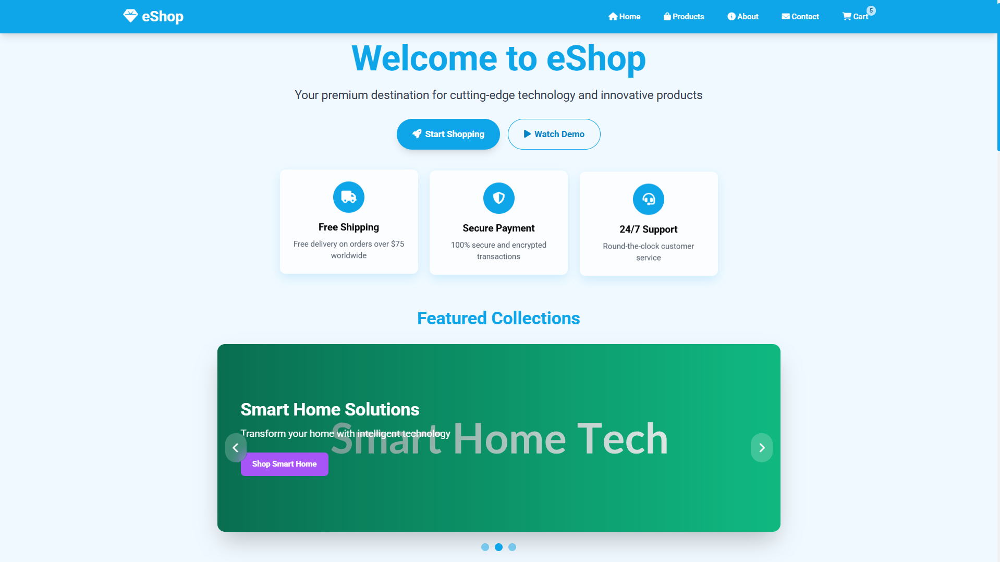
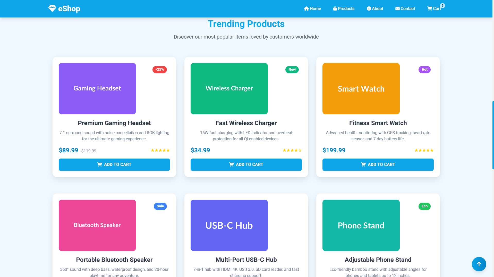
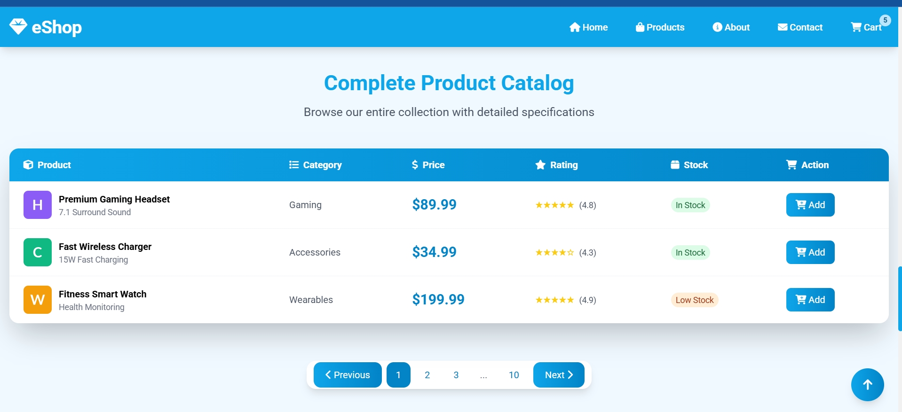
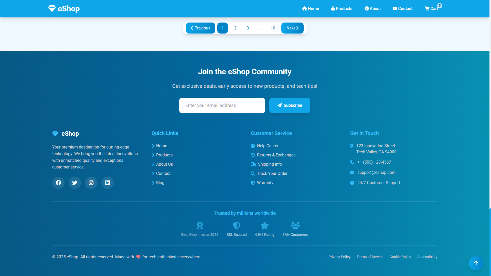

# eShop Home

A modern, responsive e-commerce landing page showcasing premium technology products with a cohesive sky blue design theme.

## Overview

eShop Home is a beautifully crafted landing page designed for a premium technology retailer. The website features a modern glassmorphism design with a consistent sky blue color palette throughout all components. Built with Tailwind CSS and enhanced with custom animations, the site provides an engaging user experience with smooth transitions and interactive elements.

### Key Features

- **Modern Design**: Clean, professional layout with glassmorphism effects and sky blue gradient themes
- **Responsive Layout**: Fully optimized for desktop and mobile viewing experiences
- **Interactive Elements**: Animated product cards, carousel slider, and floating action buttons
- **Product Showcase**: Multiple display formats including grid cards and detailed catalog tables
- **Smooth Animations**: Custom CSS animations for fade-in effects, hover states, and scroll interactions
- **User-Friendly Navigation**: Sticky navbar with smooth scrolling and intuitive page structure

### Technology Stack

- **Frontend Framework**: Tailwind CSS for utility-first styling
- **Icons**: Font Awesome 6.5.0 for consistent iconography
- **Typography**: Google Fonts (Roboto) for clean, modern text
- **JavaScript**: Vanilla JS for carousel functionality and interactive features
- **Design Elements**: Custom CSS for glassmorphism effects and blue color theming

## References

> 1. [Favicon Generator](https://favicon.io/)
> 1. [Tailwind CSS](https://cdn.tailwindcss.com)
> 1. [Customizing Colors](https://v3.tailwindcss.com/docs/customizing-colors)
> 1. [Font Awesome](https://cdnjs.cloudflare.com/ajax/libs/font-awesome/6.5.0/css/all.min.css)
> 1. [Google Fonts](https://fonts.googleapis.com/css2?family=Roboto:wght@400;500;700&display=swap)
> 1. [Placeholder Image](https://placehold.co/1200x500/8B5CF6/FFFFFF?text=Premium+Gaming+Setup)

## Screenshots

### Desktop View


_Hero section with sky blue gradient and glassmorphism cards_


_Product grid with sky blue pricing and hover effects_


_Product catalog table with sky blue header and hover states_


_Footer with sky blue gradient background and social links_

## Vibe coding Tips

```html
<!DOCTYPE html>
<html lang="en">
  <head>
    <!-- Tailwind CSS CDN -->
    <!-- Main CSS framework for utility-first styling -->

    <!-- Font Awesome CDN version 6.5.0-->
    <!-- Icon library for all icons including arrows, shopping cart, social media etc -->

    <!-- Google Fonts -->
    <!-- Roboto font family for clean, modern typography -->

    <!-- Favicon -->
    <!-- Website icon displayed in browser tab -->

    <!-- Custom CSS -->
    <!-- External stylesheet for custom animations, glassmorphism effects, and blue theme -->
  </head>

  <body>
    <!-- Sky blue themed navbar with eShop branding -->
    <!-- Sticky navigation bar with gem icon, navigation links, and shopping cart badge -->

    <!-- Hero section with gradient text, sky blue buttons, and glassmorphism cards -->
    <!-- Main banner with welcome message, action buttons, and feature highlights -->

    <!-- Carousel section with navigation controls and sky blue indicators -->
    <!-- Image slider showcasing featured product collections with auto-play -->

    <!-- Features section with sky blue icon backgrounds -->
    <!-- Grid of service highlights: quality, delivery, returns, and pricing -->

    <!-- Product grid with sky blue pricing and hover effects -->
    <!-- Trending products showcase with cards, ratings, and add to cart buttons -->

    <!-- Product catalog table with sky blue header and hover states -->
    <!-- Complete product listing in tabular format with detailed information -->

    <!-- Pagination with sky blue active states -->
    <!-- Navigation controls for browsing through product pages -->

    <!-- Footer with sky blue gradient background and social links -->
    <!-- Newsletter signup, company info, links, and contact details -->

    <!-- Floating action button with sky blue gradient and up arrow -->
    <!-- Scroll-to-top button with smooth animation and Font Awesome arrow icon -->

    <!-- Custom JavaScript -->
    <!-- External script for carousel, scroll effects, animations, and interactions -->
  </body>
</html>
```
